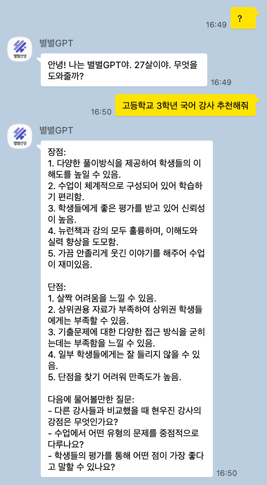
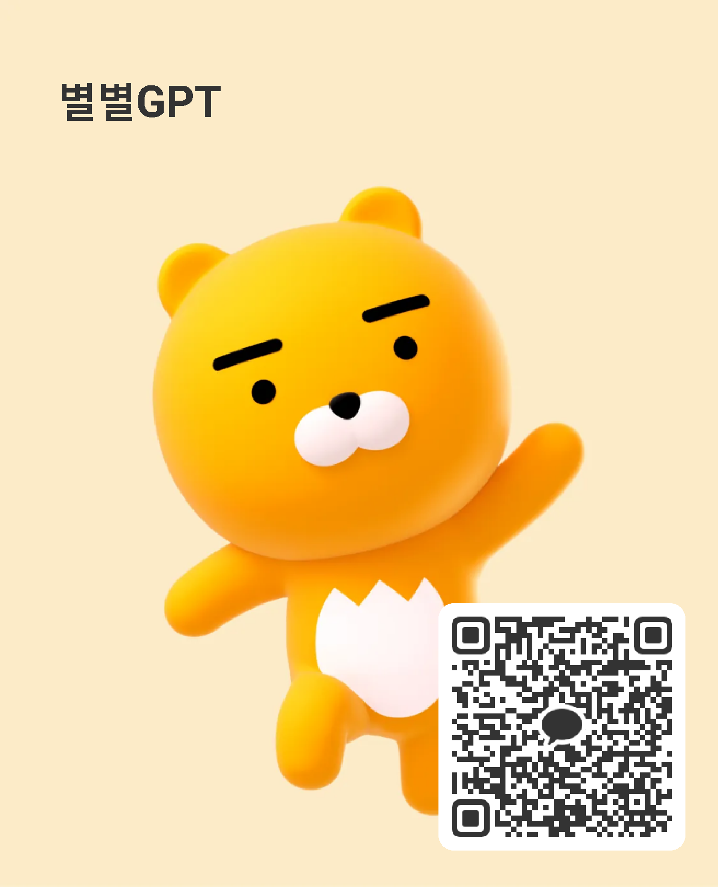

# 메신저R(회사 서비스 : 별별GPT) 카카오봇 연동 방식  
-------

선행 작업 

1. 메신저R 앱 설치 이 부분은 [메신저R 플레이스토어 링크](https://play.google.com/store/apps/details?id=com.xfl.msgbot&hl=ko&gl=US).

1-1. 가상화 안드로이드 OS를 설치 후 플레이스토어를 통해 앱 설치 하거나 APK 설치 
1-2. 안쓰는 모바일기기 OS(안드로이드 기기)에 플레이스토어를 통해 앱설치 진행

2. 카카오톡 채널이 될 전화번호 계정 등록 (투폰 번호 또는 연동용 계정)

3. 설치 후 각종 권한 관련 옵션 정의

4. 메신저R의 플로팅 버튼 + 클릭 후 사용할 이름 (EX : 챗봇GPT)

5. 생성 후 연필 아이콘 클릭 후 


전체 코드를 복사 후 메신저R에 등록 후 빌드 한후 후

```
const scriptName = "챗봇GPT";

/**

* (string) room

* (string) sender

* (boolean) isGroupChat

* (void) replier.reply(message)

* (boolean) replier.reply(room, message, hideErrorToast = false) // 전송 성공시 true, 실패시 false 반환

* (string) imageDB.getProfileBase64()

* (string) packageName

*/

function response(room, msg, sender, isGroupChat, replier, imageDB, packageName) {


replier.reply("" + getResponse(msg));

}

function getResponse(msg) {

let json;

let result;

try {

//별별 선생에 대한 소스는 제거


//각종 옵션 값
let data = {"model": "gpt-3.5-turbo",
 "messages": [{"role":"user","content": msg}],
 "temperature":0,
 "max_tokens":1024,
 "top_p":1,
 "frequency_penalty": 0.0,
 "presence_penalty":0.0
 };


chartGPT 연동 주소 키값은 따로 적지 않았습니다.
let response = org.jsoup.Jsoup.connect("https://api.openai.com/v1/chat/completions").
header("Content-Type", "application/json").
header("Authorization","Bearer " + key).requestBody(JSON.stringify(data)).
ignoreContentType(true).ignoreHttpErrors(true).timeout(200000).post()

json = JSON.parse(response.text());

result = json.message;

} catch(e){

result = e;

Log.e(e);

}

return result;

}

//아래 4개의 메소드는 액티비티 화면을 수정할때 사용됩니다.

function onCreate(savedInstanceState, activity) {

}

function onStart(activity) {}

function onResume(activity) {}

function onPause(activity) {}

function onStop(activity) {}

```



친구 추가용 QR


